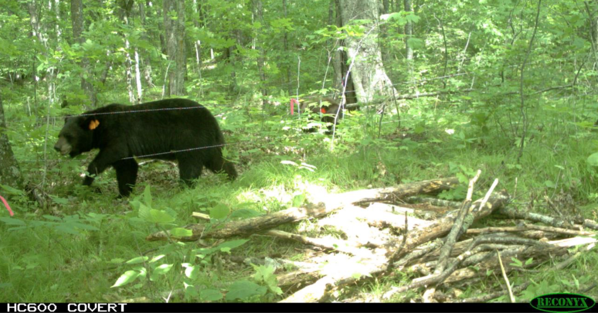
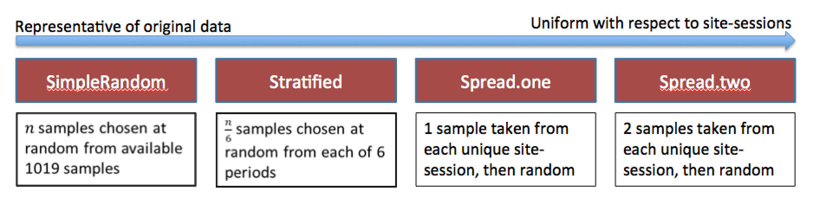
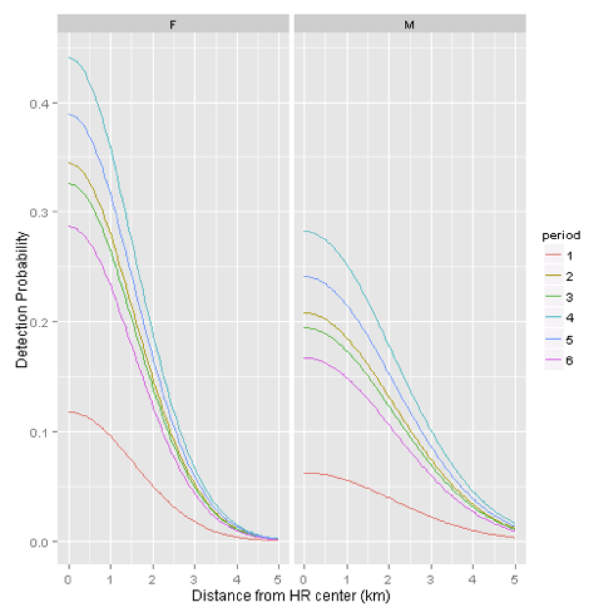
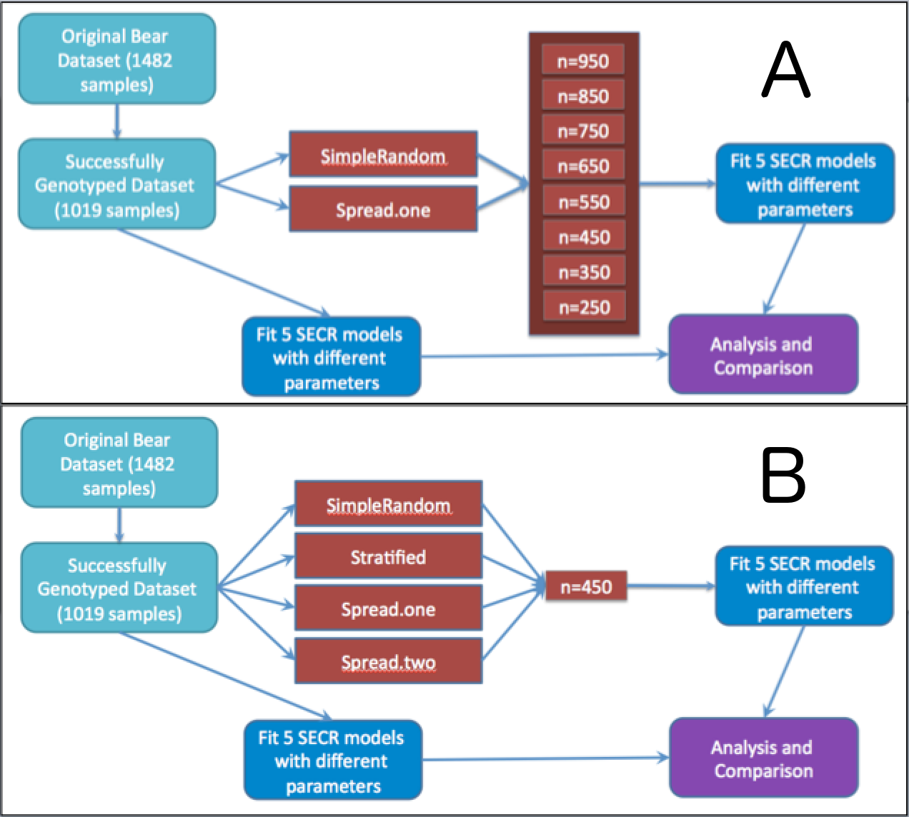

\pagebreak

\abstract
 Genetic mark-recapture studies estimate animal abundance using non-invasive DNA identification methods to "capture" and subsequently "recapture" individuals that leave genetic material at trap sites. Due to the cost of genotypic analysis, researchers often choose to process only a subsample of this genetic material. Traditional (non-spatial) mark-recapture estimators of abundance have been shown to be biased in this case, especially when the study population displays a behavioral trap response that varies at the individual level. Less is known about the influence of subsampling genetic mark-recapture data, randomly or non-randomly, when using spatially explicit capture-recapture (SECR) models to estimate abundance. We analyzed hair-snare data obtained from a 2012 genetic mark-recapture study of black bears (*Ursus americanus*), where 1019 hair samples were successfully genotyped. We simulated the process of subsampling hair samples either randomly or non-randomly. Similar to non-spatial mark-recapture estimators, subsampling produced density estimates that were lower, on average, than the full data estimate; however, non-random subsampling had much less of an effect on estimator performance, particularly at small sample sizes. Thus, non-random subsampling may be preferable to random sampling, despite the inherent violations of SECR assumptions that may result. 
 
\pagebreak

#Acknowledgements
I thank John Fieberg for guidance with both the analysis and writing portions of this project, as much of this would not have been possible without his mentorship. I thank Dave Garshelis and Karen Noyce for access to the hair snare data that was analyzed in this study, the Minnesota Chapter of the Wildlife Society for allowing me to present my work at the 2016 annual meeting in Mankato, MN, and the University (of Minnesota) Honors Program for providing me with the resources and guidance necessary to start this project.  Lastly, I'd like to thank the Fieberg lab for critiquing my work, and the various members of the Fisheries and Wildlife Department that encouraged and assisted me along the way. 

\pagebreak

#Non-technical Summary

Mark-recapture studies, in which animals are 'tagged' and released, are often used by wildlife managers to estimate animal abundance. Usually, this involves physically capturing the animal in a trap (net, snare, etc), and physically tagging the animal with a unique number combination, so that it can be identified later on. Alternatively, animal's DNA can be used as a unique identifier, which facilitates studies that are less invasive and less costly than tagging by hand. Most of these methods involve hair snare traps - a baited lure is placed inside of a barbed wire perimeter, so that when the animal investigates the bait, they leave some hair behind which can be idenitified to determine the bear's identity. However, contrary to previous methods where an individual's identity could be determined simply by reading numbers on a tag, the hair samples need to be analyzed in a genetics lab to determine the bear's identity - which can quickly increase the cost of conducting a study. So, most of the time, managers subsample their hair samples to reduce their costs. 
\vspace{0.3cm}

This sort of subsampling has been shown to be problematic for getting reliable population estimates, especially in species that have strong 'personalities' - for example, if one bear loves the bait, and leaves hundreds of samples, he is very likely to be included in a subsample. If a bear hated the whole experience, and left only one sample, he's much less likely to be included. Unfortunately, that might not be the only problem. Most abundance estimators inflate counts of observed individuals by an estimate of an individual's capture probability, which is essentially how likely a single animal is to be captured (in this case, to leave hair). This is calculated by observing how frequently we capture the individual. When we subsample, we're much more likely to analyze samples from bears that are captured over and over again, so we calculate a capture probability that is too high, because we miss out on the individuals that are hard to capture. We then use that capture probability to derive abundance - when the capture probability is too high, we tend to have population estimates that are too low. 
\vspace{0.3cm}

While subsampling *usually* causes problems, some hair samples actually don't contribute any new information. Traditionally, we would say an animal is 'captured' if we see it anywhere in our study area in a given time frame, regardless of where it was. As a result, a lot of the data we analyze just confirms what we already knew - for example, we know bear X was in the area from May 10 to May 20 after we see one of his hair samples, and any more of his hair we analyze during that time frame is useless, because we already knew he was there. A relatively new estimator (spatially explicit capture recapture, or SECR) actually uses this previously 'useless' data to estimate movement characteristics of the animal, and hence, the animal's likelihood of leaving a hair sample at each trap. Because of much of this formerly useless data gets thrown out when subsampling, we had reason to believe that SECR estimates may change quite a bit after the data is subsampled. 
\vspace{0.3cm}

To investigate this, we subsampled some real hair snare data from northern Minnesota bears in a few different ways, and fit SECR models to those subsamples. We found we could minimize the effect of subsampling by choosing to process samples from as many site and time period combinations as possible, even if that meant that we were no longer sampling in a completely random fashion. Doing so means that the subsampled data no longer *accurately* describes each animal's movement characteristics (as described above), but it means that we are more likely to analyze hair samples from new individuals and individuals that leave very few samples. In this case, the trade-off was worth it. 
\vspace{0.3cm}

While we can't make generalizations yet, because we don't know how many bears were truly out there when the hair samples were obtained, we argue that subsampling *is* problematic for SECR models. However, depending on the behavior of the animals being studied, the effects likely vary - if animals have a tendency to leave many samples at a single site, we predict that subsampling may be less of an issue. Regardless, this problem has not been given much attention yet, and our results can provide some initial qualitative guidance to wildlife managers making decisions about how (or if) they should subsample their data in anticipation of using SECR models to estimate population size.
\pagebreak

\tableofcontents

\pagebreak

#Introduction
Mark-recapture studies are routinely used by wildlife managers to estimate animal abundance; especially in the case of endangered species and game animals, abundance and its associated temporal trends are of critical importance for making informed management decisions [@McCrea_Analysis; @Borchers_Estimating_2002]. In many cases, however, abundance estimates can be difficult to interpret without some understanding of the effective area sampled; extrapolation to a regional scale by way of density is almost always desired, if not necessary  [@Royle_Spatial_2013; @Borchers_Estimating_2002]. As such, abundance estimates without associated reliable density estimates may be of limited use to managers. 
\vspace{0.3cm}

Density estimates have often been obtained from abundance estimates using ad-hoc methods that range widely in their biological relevance [@Royle_Spatial_2013]. Spatially-explicit capture recapture methods (SECR), by contrast, link abundance estimators to their associated study area in a statistically rigorous way [@Efford_A_2005; @Borchers_A_2012; @Royle_Spatial_2013]. SECR estimates of abundance scale directly with a given sample area, potentially allowing for more standardization of estimates across space or time. SECR models also make better use of the capture-recapture data.  In particular, SECR models utilize the information in the spatial capture histories to model detection probabilities as a function of the distance between each animal's activity center (AC) and the trapping grid. By accounting for each individual's movement tendencies, SECR provides a way to account for an important source of individual heterogeneity in capture probabilities that is unaccounted for in traditional (non-spatial) mark-recapture estimators. 
\vspace{0.3cm}

We explored a popular method for estimating abundance of mammal populations: genetic mark-recapture, where individuals are identified by sequencing the genome of residual genetic material left at a trap site [@BuckworthTerritory2012; @BoulangerHimmerSwan2004; @Petit_Estimating_2006; @Gervasi_A_2008]. Many studies aim to obtain hair samples, often by the use of baited traps and hair-snares, which provide a relatively non-invasive and efficient way to ascertain the identity of detected animals when compared to live capture. However, due to the costs of genotypic analysis, managers are often forced to subsample their hair clusters [@Settlage_Challenges_2008;@BoulangerHimmerSwan2004; @Petit_Estimating_2006; @Gervasi_A_2008].
\vspace{0.3cm}

Subsampling has been shown to be problematic for non-spatial mark-recapture estimators, especially when individuals exhibit a behavioral response to having been previously captured, and this behavioral response is not consistent across individuals [@Augustine_Accounting_2014; @TredickVaughanStaufferEtAl0; @Ebert_Individual_2010]. In this case, individuals that leave many hair clusters are likely to be identified in a subsample, whereas individuals that leave few clusters are often excluded. In other words, clusters selected in a subsample are likely to come from individuals that are repeatedly captured. As a result, estimates of capture probability are biased high and abundance estimates are biased low; this effect is more pronounced as subsample size decreases [@Augustine_Accounting_2014]. 
\vspace{0.3cm}

A fundamental difference between SECR and non-spatial capture-recapture models relates to how they treat multiple captures of the same individual during the same time period.  Whereas non-spatial models collapse multiple captures at different traps (same time period) into a single capture event, these multiple captures would be used to inform individual movement characteristics in a SECR model (Borchers 2012; Royle et al. 2013). Thus, samples that are redundant in a non-spatial model (captures at $>1$ trap location in a single period) are of critical importance to SECR models. As a result, the effects of subsampling may be even more problematic for SECR models when compared to non-spatial capture-recapture models. 
\vspace{0.3cm}

In response to the knowledge that multiple samples from one individual in the same period are redundant in non-spatial models, managers often avoid taking multiple samples from a single trap under the assumption that they are likely to be from the same individual, and thus not informative and not worth the cost of genotypic analysis. This strategy is effective for use with non-spatial models; analyzing several samples from the same site often leads to diminishing returns in precision and accuracy [@DreherRosaLukacs2009a]. Instead, preference is given to samples from novel site by session combinations (hereafter referred to as site-sessions), because they are more likely to represent new individuals. This non-random sampling could cause issues in SECR models by violating the assumption that the observed samples reflect the movement characteristics of the study population. A natural solution to this violation is to avoid preference for novel site-sessions (ie, simple random sampling), at the cost of identifying fewer unique individuals and analyzing more redundant data.  
\vspace{0.3cm}

Various simulation and empirical studies have addressed the issue of subsampling on non-spatial mark-recapture estimators, with a general conclusion that subsampling genetic mark-recapture data results in estimators that are biased low, but that the magnitude of this bias depends on the actual data at hand and several assumptions such as erroneous genotyping rate and trap spacing [@Augustine_Accounting_2014; @TredickVaughanStaufferEtAl0; @DreherRosaLukacs2009a]. The tradeoff between potential redundancy (using simple random sampling) and non-representation of movement characteristics (using non-random sampling) has not been investigated in the context of SECR models. **In this study, our objective was to use northern Minnesota genetic mark-recapture dataset with 1019 successful samples to compare abundance and density estimates using (1) various subsampling strategies utilized by wildlife managers and researchers and (2) various subsampling rates reflective of different budgetary constraints. ** Using these results, we provide guidance for genetic mark-recapture estimates when budget constraints limit effective sample size. 
\vspace{0.3cm}

#Methods

The subsections below describe the nature of the data analyzed and the procedure followed in this study. The resultant code can be found in the Appendix under subsection "Code Documentation". 
\vspace{0.3cm}

##Data

The data analyzed in this study come from a 2012 genetic mark-recapture study of American black bears (*Ursus americanus*) in northern Minnesota [@Cap_hair]. Using stationary hair-snare traps baited with suspended bacon and scent lures, the authors collected 1642 hair clusters (groups of hair samples obtained from adjacent barbs) from 121 sites over six trapping sessions from May through July 2012, each of ten day length. Of these 1642 clusters, 1113 were sent to a genetics laboratory for genotypic analysis, and 1019 samples were successfully linked to individual bears. 
\vspace{0.3cm}

It is important to note that the 1113 samples analyzed were effectively a subsample to begin with; the authors initially chose samples from 377 unique site by session combinations (site-sessions), with the remaining 776 samples chosen randomly. Given that the majority of samples were analyzed (67.7%), and that the majority of these samples were chosen randomly from the original sample set, we will treat the dataset as if it is representative of the population of interest. 
\vspace{0.3cm}

Camera traps fitted to a subset of the trap locations indicated that bears occasionally visited the same trap several times in a single session, often using several different entry locations to approach the bait hung at the center of the trap. This individual variation is evidenced in the number of samples left at a given site-session by individual bears; 47% of the time, bears left only a single sample at a given site-session, but some left as many as 11, and some may have left even more considering that 529 samples were not analyzed [@Cap_hair]. Additionally, movement characteristics differed strongly between individuals; 53% of bears visited between one and five unique sites, but bears visited up to 24 unique sites over the 6 sample periods.
\vspace{0.3cm}

##Subsampling 
We chose to explore four subsampling strategies, but two are of primary importance: simple random sampling and a subsampling method that gives preference to unique site-sessions (Figure 2). These are described below:

- SimpleRandom - n samples are chosen at random from the entire data set, without respect to period or site. This type of sampling is, on average, most representative of the original data set; for example, site-sessions that have a large number of samples would have a the largest number of samples in the subsample, and site-sessions with only one sample are unlikely to be chosen. 

- Stratified - n/6 samples are chosen at random from each of 6 sessions, without respect to site. It is important to note that this differs from a stratified random sample with proportional allocation, i.e., where the number of samples chosen from each session would be weighted by the number of samples in each session relative to the number of samples overall. 

- Spread.one - one sample is chosen from each unique site-session. After this, samples are chosen randomly until n samples are selected.  At n < 377, this strategy is idenitical to Spread.two. 

- Spread.two - two samples are chosen from each unique site-session. After this, samples are chosen randomly until n samples are selected. This method is least representative of the original data, and effectively maximizes the number of site-sessions (and thus, unique individuals) included in analysis; for example, each unique site-session with only one or two samples have both of those samples chosen, and site-sessions with large amounts of samples are under-represented relative to the original dataset. At n < 377, this strategy is idenitical to Spread.one. 

##Model Structure

A SECR model is unique from other mark-recapture models in that an animal’s capture probability is derived using the animal’s activity center (AC) [@Royle_Spatial_2013; @Borchers_Estimating_2002]. Though many curves are used to characterize how detection probabilities change as a function of distance between an animal's activity center and a trap location, a common and readily understood choice is a half-normal curve, using two parameters: $g0$ and $\sigma$. $g0$ represents the probability of detecting an animal whose activity center is located exactly at the trap location. $\sigma$ represents the rate at which this probability decreases as an animal’s homerange center moves further away from the trap. 
\vspace{0.3cm}

Similar to other population models, these parameters can be allowed to vary by sex (Sex), time (t), and they may be allowed to change following an initial capture event (i.e., a behavioral trap response (b)). In figure 3, $g0$ was modeled as a function of time and sex ($g0$ ~ t + Sex) and $\sigma$ varied by sex only ($\sigma$ ~ Sex); as such, each time and sex combination has its own intercept and capture probabilities decrease at different rates for males and females as a function of distance. Time effects may also be modelled in a structured, linear fashion (eg, $g0$ ~ $T$ instead of $g0$ ~ $t$), meaning that there is a trend in the change of intercept detection probability; this would be appropriate if detection probabilites decreased or increased monotonically over time. 
\vspace{0.3cm}

##Model Fitting

We fit 5 SECR models, each with a different combination of explanatory variables, to each subsampled dataset. In each case, we assumed $\sigma$ varied only by sex. We explored five models with different covariates influencing $g0$ (Table 1). 
\vspace{0.3cm}

| $g0$ Covariates| AICc| $\Delta AICc$ | Bears/100 sq mile(*95% Confidence Interval*)|
|-------------:|---:|:---|----:|
|  b + t + Sex |  3492|0   |    13.50  (*9.86,18.48*)|
|      t + Sex |  3496|4   |    12.67  (*9.30,17.26*)|
|  b + t       |  3502|10  |    13.60  (*9.93,19.64*)|
|      t       |  3507|15  |    12.55  (*9.22,17.08*)|
|  b           |  3515|23  |    14.23 (*10.41,19.46*)|

Table: Density estimates and Aikaike Information Criterion (AICc) scores associated with spatial-mark recapture (SECR) models fit to 1019 hair samples taken from black bears in Minnesota from May through July 2012.  $\Delta AICc$ represents the difference from the lowest scoring model and the compared model.  All models were fit using the R programming language and package secr. 'b' represents a behavior covariate, 't' represents a non-linear time covariate, and 'Sex' a sex covariate.  
\vspace{0.3cm}

Models were fit using the R programming language [@R_Core], package ‘secr’ for the fitting of the SECR models, and packages ‘foreach’ and ‘doParallel’  for optimization of model fitting using parallel processing [@secr; @foreach; @doParallel].  The main function for fitting models to subsampled data is secr.fit in package ‘secr’.  This function requires a capture history and a trapping grid to arrive at a derived density estimate and estimated parameters describing the effect of time, sex, and/or behavior on capture probabilities [@Royle_Spatial_2013].
\vspace{0.3cm}

##Simulation

In this study, a single ‘simulation’ can be broadly defined as subsampling the full dataset using one of the subsampling strategies (Figure 2), fitting of five SECR models with varying covariates (Table 1), and saving model output for later comparison (Figure 4). Initially we varied the subsampling strategy while holding sample size constant at n = 450 hair samples (Figure 2, 4B).  This allowed us to evaluate the influence of subsampling strategy on the derived density estimate of each SECR model; these simulations are referred to as ‘subsampling trials’ in this document as well as in the accompanying code documentation.
\vspace{0.3cm}

We then considered two subsampling types (SimpleRandom and Spread.one) for further study. In a second set of ‘size trials’, we explored these two approaches across a range of sample sizes (n = 250 to 950, by 100) (Figure 4A). 
\vspace{0.3cm}

##Notation

Let $\hat{D}_{data,model}$ refer to a density estimate from the fit of a SECR model to dataset of type *data* (either full, so, or, sr), and *model* used to indicate the set of covariates for $g0$. For example, $\hat{D}_{full,b}$ represents the density estimate using the full dataset and behavior as the sole covariate for $g0$. $\hat{D}_{sr,b+t}$ represents a density estimate using a simple random sample and both behavior and time as covariates for $g0$; $\hat{D}_{so,t}$ represents a density estimate using the spread.one subsampling method and time as a covariate for $g0$
\vspace{0.3cm}

Let $M_{model}$ refer to a SECR model with *model* again used to indicate the set of covariates for $g0$. For example, $M_{b+t+Sex}$ refers to a model with behavior, time and sex as covariates for $g0$.
\vspace{0.3cm}.

Let $g0_{full}$ refer to the estimate of $g0$ using the full dataset, and let $g0_{sr}$ and $g0_{so}$ refer to $g0$ estimates obtained when subsampling using SimpleRandom and Spread.one, respectively. Further, let $g0b$ represent the difference between intial and recapture probabilities. Again, we will use subscripts to refer to the dataset and model used to estimate this parameter. 

#Results

##Full Dataset Estimates

$M_{b+t+Sex}$ had the lowest AIC score of the five models investigated (Table 1). Estimates that included behavior as a parameter for $g0$ (ie, $\hat{D}_{full, b+t+Sex}$, $\hat{D}_{full, b+t}$, and $\hat{D}_{full, b}$) resulted in larger density estimates than models that excluded behavior ($\hat{D}_{full, t + Sex}$, and $\hat{D}_{full, t}$), with $\hat{D}_{full, b}$ resulting in the largest density estimate (14.23) and $\hat{D}_{full, t}$ resulting in the smallest density estimate (12.55) (Table 1).  
\vspace{0.3cm}

##Simulation Study I: Subsampling Strategy

All distributions of $\hat{D}_{sr, model}$ were shifted towards lower values compared to $\hat{D}_{full, model}$, regardless of the model analyzed. Further, in all cases, sampling distributions of $\hat{D}_{sr}$ were more variable than sampling distributions of $\hat{D}_{so}$ (Figure 5). 
\vspace{0.3cm}

With n=450, sampling distributions of $\hat{D}_{so, b+t+Sex}$, $\hat{D}_{so, b+t}$, and $\hat{D}_{so, b}$ were centered on the corresponding estimates of the full dataset ($\hat{D}_{full, b+t+Sex}$, $\hat{D}_{full, b+t}$, and $\hat{D}_{full, b}$; Figure 5), whereas the sampling distributions for $\hat{D}_{full, t+Sex}$ and $\hat{D}_{full, t}$ were shifted towards lower values (Figure 5, bottom row).
\vspace{0.3cm}

##Simulation Study II: Sample Size

As expected, similar to non-spatial mark-recapture estimates, smaller sample sizes produced more variable estimates, with greater discrepancies between $\hat{D}_{sr, model}$ and $\hat{D}_{full, model}$. However, models $M_{b+t+Sex}$, $M_{b+t}$, and $M_{b}$ resulted in sampling distributions of $\hat{D}_{so, model}$ that were centered at the corresponding estimate of $\hat{D}_{full}$, regardless of sample size (Figure 6, bottom row). Similar to the previously discussed trends, distributions of $\hat{D}_{so}$ were also closer to $\hat{D}_{full}$ when a behavioral effect was not modelled ($M_{t+Sex}$ and $M_{t}$). 
\vspace{0.3cm}

To better understand these results, we investigated the effect of subsampling on intial capture and recapture probabilities across different sample sizes using $M_{b+t+Sex}$. Similar to the effects of subsampling on non-spatial mark-recpature parameter estimators, estimates of both $g0_{sr}$ and $g0_{so}$ were were, on average, larger than $g0_{full}$. Further, estimates of both $g0b_{sr}$ and $g0b_{so}$ were, on average, larger in absolute magnitude relative to $g0b_{full}$. These effects were more pronounced as subsample size decreased, and were also more pronounced when using SimpleRandom subsampling than when using Spread.one (Figure 7).    
\vspace{0.3cm}

![Estimated $g0$ (initial capture probability) and $g0b$ (difference between initial and recapture probability) for different sample sizes of two subsampling types, SimpleRandom and Spread.one (described in Figure 2). The horizontal red line indicates the value when fitting this model ($g0$ ~ b + t + Sex) on the full dataset. The other four models displayed similar effects with respect to $g0$. The other two models which included a behavioral covariate for $g0$ displayed similar trends with respect to $g0b$.](g0andg0b.png)

\pagebreak

#Discussion

##Subsampling Performance

Our simulation results suggest that SECR density estimators, like their non-spatial counterparts, are biased low when applied to subsampled data [@Augustine_Accounting_2014; @TredickVaughanStaufferEtAl0]. These effects were minimal, however, when using a subsampling method that gives preference to unique site-sessions (Spread.one), provided that a behavioral effect was included in the model. Distributions of $\hat{D}_{so}$ were closer to $\hat{D}_{full}$ at most subsample sizes for each model (Figure 6), and similarly, estimates of $g0_{so}$ and $g0b_{so}$ were closer to their full dataset counterparts (Figure 7). Non-random sampling increased the number of uniquely identified individuals (especially those that left only one or two samples), which outweighed the inherent cost of violating SECR's assumption that the capture history provides an accurate description of individual movement characteristics. 
\vspace{0.3cm}

Bears in this study exhibited considerable heterogeneity in their behavioral response [47% of the time, bears left only a single sample at a given site-session, but some left as many as 11; @Cap_hair]. As a result, subsampling the data using simple random sampling was much more likely to select redundant data from bears that tended to leave several samples at a single site-session. Conversely, non-random sampling likely performed well because much of the data it excluded from the full dataset was redundant (same bear, same site, same session), and thus it increased the likelihood of including novel samples. 
\vspace{0.3cm}

Key assumptions in this study include the treatment of the full dataset as a representative sample from the population - Noyce and Garshelis [-@Cap_hair] successfully subsampled 67.7% of samples, so there is likely an unmodelled behavioral effect from the samples that were not originally analyzed when the study took place. Further, these analyzed hair samples were already non-random to a degree (377 non-random with preference to unique site-sessions and 776 completely random), so our analysis may be missing novel individuals or known individuals' locations that were similarly not identified in the original genotypic analysis. However, it is also likely that many of these samples were redundant due to the strong individual heterogeneity noted in this study.  Additionally, we analyzed only successful samples, and thus ignored the possibility of failure to indentify individuals from a submitted sample; however, because our dataset was not simulated, there may have been false indentification of individuals due to allelic dropout or false amplification [@DreherRosaLukacs2009a], or the 'shadow effect' - erroneously treating a novel individual as a recapture due to similarity in their genotype [@Mills_Estimating_2000]. 
\vspace{0.3cm}

##Future Analysis

The work presented here indentifies an issue that has not previously been given much attention; that subsampling may be more problematic for SECR models than non-spatial mark-recapture estimates. Our simulations suggest that using a strategy to maximize site-sessions within an analyzed subsample may ameliorate these problems, but the optimal strategy likely depends on the characteristics of the observed study population. Further simulation is needed before we can make more general conclusions and recommendations regarding the effect of subsampling methodology on SECR estimates; this could be accomplished by simulating genetic mark-recapture data with varying degrees of behavioral responses and various genotypic error rates (both positive bias inducing, in the case of shadow effects, or negative, in the case of allelic dropout and false amplification) to see when the trade-offs between the subsampling methods presented here begin to favor random sampling. Yet, the insights we have gained through our simulations allow us to make several predictions.
\vspace{0.3cm}

In a simulated case with no redundant samples (eg, each bear that enters a trap leaves exactly one sample and leaves, and $g0b = 0$), one might expect random sampling to perform better (less biased, more precise) than a non-random sample, as the former would be more representative of the actual biological processes affecting movement patterns, and thus better model the heterogeneity in capture probability that arises from those patterns. As redundant samples are introduced (eg, each bear that enters a trap leaves more than one sample and leaves), one might expect that preference to unique site-sessions would once again perform best, as it did in our simulations using empirical data. 
\vspace{0.3cm}

#References

