This script will read in the existing Bear Est data and compare them, using a bwplot. 
(1/21/16)


```r
library(mosaic)

BearEst<-read.csv("../data/SubsamplingData/FinalBearEst.csv")
colnames(BearEst)<-c("SubID", "densEstimate", "ucl", "lcl", "Subtype", "Model")
```

Number of Observations for each subtype X model. As of 1/21, there are ~16 for each. 
As of 1/22, almost 25 for each. 100 should be attainable by around the 30th of Jan. 


```r
tally(Subtype~Model, data=BearEst)
```

```
##               Model
## Subtype        Model A Model B Model C Model D Model E
##   SimpleRandom      25      25      25      25      25
##   Spread.one        28      28      28      28      28
##   Spread.two        26      26      24      26      27
##   Stratified        34      33      33      31      28
```

ADD IN FULL MODEL VALUES HERE


```r
fullModel<-c(14,15,14,13,14)
names(fullModel)<-c("Model A", "Model B", "Model C", "Model D", "Model E")
```

A box-whisker plot function to streamline the process for each model. 


```r
BearBWplot<-function(model="Model A"){
  ggplot(filter(BearEst, Model==model), aes(x=Subtype, y=densEstimate))+
    geom_boxplot() +
    ylab("Density Estimate (Bears per Sq Mile)")+
    ggtitle(model) +
    geom_hline(yintercept=fullModel[model], col="red") 
    }
```

Treating all models the same, how does the subtype affect estimate


```r
ggplot(BearEst, aes(x=Subtype, y=densEstimate))+
  geom_boxplot() +
  ylab("Density Estimate (Bears per Sq Mile)")+
  ggtitle("All Models")
```

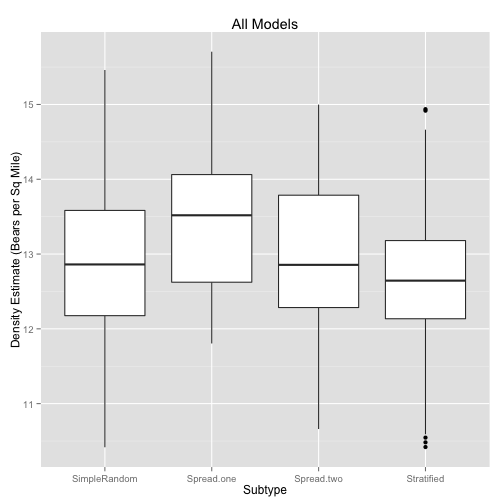 

Constructing a bwplot to see the difference between the different subtypes for each model


```r
BearBWplot("Model A")
```

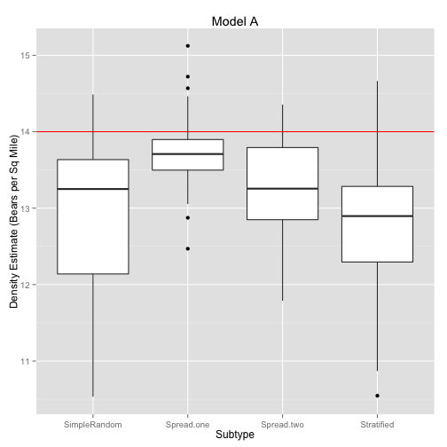 

```r
BearBWplot("Model B")
```

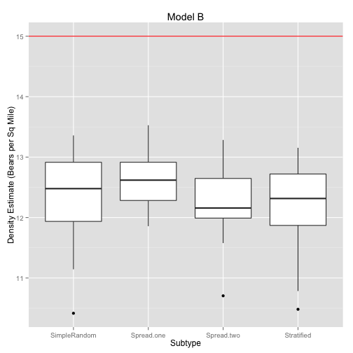 

```r
BearBWplot("Model C")
```

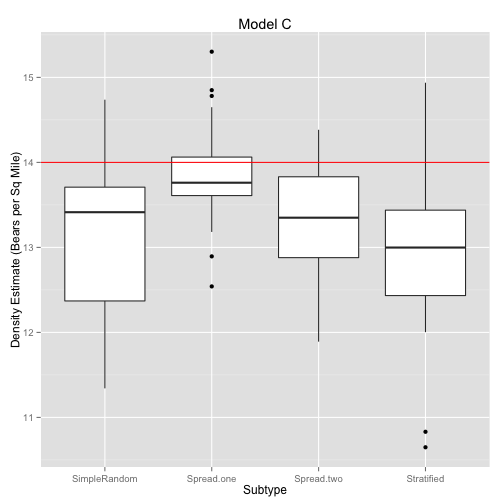 

```r
BearBWplot("Model D")
```

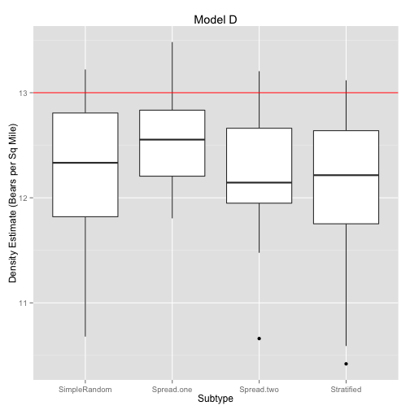 

```r
BearBWplot("Model E")
```

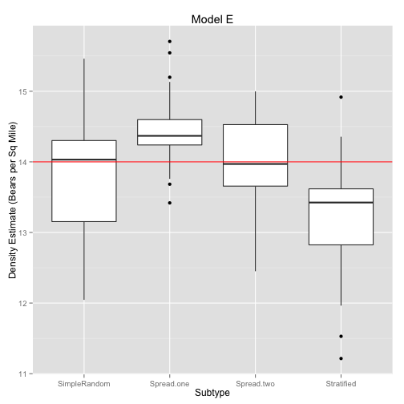 

Look at the residuals between the full model and the means of the subtypes. 


```r
BearResid<-function(model="Model A"){
  resids<-mosaic::mean(densEstimate~Subtype, data=filter(BearEst, Model==model))-fullModel[model]
  barplot(resids, ylim=c(-1,1))
}
BearResid("Model A")
```

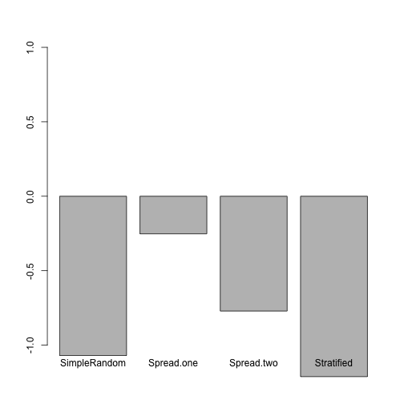 

```r
BearResid("Model B")
```

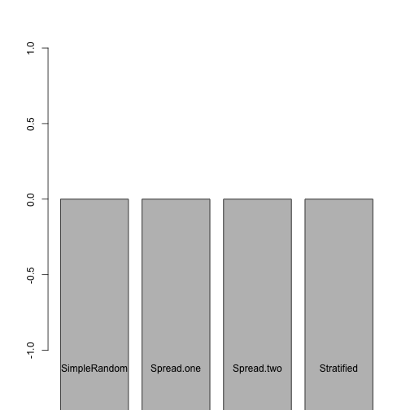 

```r
BearResid("Model C")
```

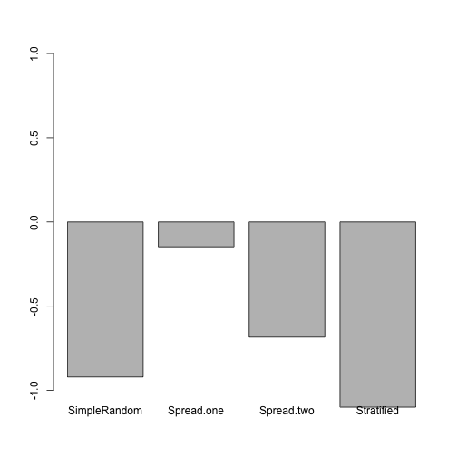 

```r
BearResid("Model D")
```

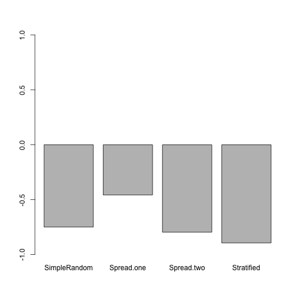 

```r
BearResid("Model E")
```

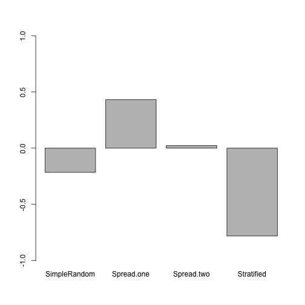 

Another useful look at the data: ANOVA to see if the estimates are significantly
different from one another


```r
bearmod<-lm(densEstimate~Subtype, data=BearEst)
Anova(bearmod)
```

```
## Anova Table (Type II tests)
## 
## Response: densEstimate
##           Sum Sq  Df F value    Pr(>F)    
## Subtype    49.45   3  19.279 6.738e-12 ***
## Residuals 469.35 549                      
## ---
## Signif. codes:  0 '***' 0.001 '**' 0.01 '*' 0.05 '.' 0.1 ' ' 1
```

Now by model - Interesting, they are only significantly different in A, C, E (as of
1/22/16) and those are the three that have behavior as a parameter for g0!


```r
Anova(lm(densEstimate~Subtype, data=filter(BearEst, Model=="Model A")))
```

```
## Anova Table (Type II tests)
## 
## Response: densEstimate
##           Sum Sq  Df F value    Pr(>F)    
## Subtype   15.803   3  8.8168 2.767e-05 ***
## Residuals 65.124 109                      
## ---
## Signif. codes:  0 '***' 0.001 '**' 0.01 '*' 0.05 '.' 0.1 ' ' 1
```

```r
Anova(lm(densEstimate~Subtype, data=filter(BearEst, Model=="Model B")))
```

```
## Anova Table (Type II tests)
## 
## Response: densEstimate
##           Sum Sq  Df F value  Pr(>F)  
## Subtype    2.873   3  2.5533 0.05927 .
## Residuals 40.511 108                  
## ---
## Signif. codes:  0 '***' 0.001 '**' 0.01 '*' 0.05 '.' 0.1 ' ' 1
```

```r
Anova(lm(densEstimate~Subtype, data=filter(BearEst, Model=="Model C")))
```

```
## Anova Table (Type II tests)
## 
## Response: densEstimate
##           Sum Sq  Df F value    Pr(>F)    
## Subtype   14.965   3  8.3304 5.029e-05 ***
## Residuals 63.474 106                      
## ---
## Signif. codes:  0 '***' 0.001 '**' 0.01 '*' 0.05 '.' 0.1 ' ' 1
```

```r
Anova(lm(densEstimate~Subtype, data=filter(BearEst, Model=="Model D")))
```

```
## Anova Table (Type II tests)
## 
## Response: densEstimate
##           Sum Sq  Df F value  Pr(>F)  
## Subtype    3.036   3  2.7441 0.04674 *
## Residuals 39.087 106                  
## ---
## Signif. codes:  0 '***' 0.001 '**' 0.01 '*' 0.05 '.' 0.1 ' ' 1
```

```r
Anova(lm(densEstimate~Subtype, data=filter(BearEst, Model=="Model E")))
```

```
## Anova Table (Type II tests)
## 
## Response: densEstimate
##           Sum Sq  Df F value    Pr(>F)    
## Subtype   21.527   3  13.846 1.154e-07 ***
## Residuals 53.900 104                      
## ---
## Signif. codes:  0 '***' 0.001 '**' 0.01 '*' 0.05 '.' 0.1 ' ' 1
```

