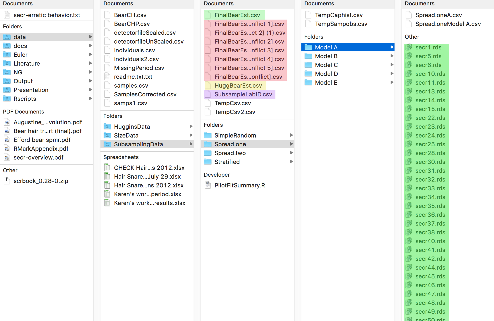

#Code Documentation

This section is meant to document and explain various functions and scripts that were created in my (Nick Gondek) spring 2016 thesis project with John Fieberg and Dave Garshelis. 

Generally, the process is broken down into three steps - subsampling (BearSubsample), data transformation (BearSumFunc), and model fitting/storage (BearParallelModelFit). Three functions perform these three steps, and one function aggregates them into a single overarching function (BearParallelSubSECR). Two scripts use this function in a loop to perform many iterations of this process, one varying the subsampling type, and one varying subsampling type while also varying subsample size (FloridaScript.R and MankatoScript.R, respectively).

In the document below, various chunks will represent different R scripts and functions, and will be annotated in order to explain how each contributes to the final product. 

### Table of Contents

**Subsampling Function**

I) BearSubsample.R
    a) Summary
    b) Arguments
    
**SECR Functions**

II) BearSumFunc.R
    a) Summary
    b) Arguments
III) BearParallelModelFit.R
    a) Summary
    b) Arguments
    c) File Structure
IV) BearSubParallelSECR.R
    a) Summary
    b) Arguments
    
**Huggins Function**

V) BearHugginsParallel

**Looping Scripts**

VI) FloridaScript.R
VII) MankatoScript.R

**Analysis Scripts**

VIII) EstimateSummary.R
IX) SizeSummary.R

**Appendix**

X) Example SECR Simulation
XI) Other Scripts and Functions
    a) BearModelFit.R and BearSubSECR.R
    b) Synthesisv2.R, Synthesisv3.R, and PilotFitSummary.Rmd
    c) VerificationSECR.rmd and VerificationSECR_corrected.Rmd
    d) Data Exploration.R and Data ExplorationUpdated.R
    e) Data Summary.R
    f) huggins.R and HuggyBear.R
    g) SecrAll1.R and SecrAll2.R
    
### Subsampling Function

#### I. BearSubsample.R

**a. Summary**

This function takes in a sample observation data frame (which is constructed both in DataExplorationUpdated.R and the eventual funtion BearParallelSubSECR.R) and subsamples it according to the four methods that were chosen, explained in greater detail below. The input is a large data frame of sample observations (~1000), and the output is a subsampled data frame of sample observations (Usually ~450, but this varies later on). 

**b. Arguments**

*data* - A sample observation data frame to be subsampled. This is constructed both in DataExplorationUpdated.R and the eventual funtion BearParallelSubSECR.R. 

*type* - The subsampling type to be used ("SimpleRandom", "Stratified", "Spread.one", "Spread.two").

a) SimpleRandom - takes a random sample of size n from the entire data set, without any respect to sites or sessions. This is done by using mosaic's sample function, which works on data frames. 

b) Stratified - a stratified sample taking n/6 random samples from each of the 6 periods. Note the difference between a **true stratified random sample** in that the samples are taken disproportionately from each period - instead of weighting each period based on their number of samples, a constant n/6 are taken from each period. This is performed using a for loop which iterates over the 6 periods and using the same mosaic sample function as above.

c) Spread.one - takes a single sample from each site x period combination. This is done using mutate, by creating a new variable called uniqueID which is a numeric of site x period. The data is then subsetted using a logical vector (!duplicated(uniqueID)) to take every unique combination, and then filled out with a random sample of the leftovers. 

d) Spread.two - takes two samples from each site x period combination. This is done using mutate, by creating a new variable called uniqueID which is a numeric of site x period. The data is then subsetted twice in a for loop using a logical vector (!duplicated(uniqueID)) to take every unique combination, and then filled out with a random sample of the leftovers. 

*n* - The number of observations to be 'genotyped' - for the initial subsampling types, this was fixed at 450. 

```{r eval=FALSE}
BearSubsample<-function(data, type, n){
  require(dplyr)
  if (type=="SimpleRandom"){ ##Simple random (all n taken at random with no regard 
                             ##to period or site)
     selected<-mosaic::sample(data, size=n)
  }
  
  
  if (type=="Stratified"){##For each of the six periods 
    selected<-NULL
    for (i in (1:6)){         
      new<-mosaic::sample(data[data$Period==i,], size = n/6)
      selected<-rbind(selected, new)
      selected<-filter(selected, !(is.na(Period)))
    } 
  }
  
  if (type=="Spread.one"){##First take 1 from each site X period, then random
    selected<-NULL
    droprow<-NULL
    data<-mutate(data, uniqueID=(site*as.numeric(Period)))
    data<-sample(data)##Mix them up, then take the first one from each uniqueID
    
    selected<-data[!duplicated(data$uniqueID),]
    droprow<-(!duplicated(data$uniqueID)) * c(1:nrow(data))
    data<- data[-droprow,]
    
    selected<-rbind(selected, mosaic::sample(data, size=(n-nrow(selected))))
  }
  
  if (type=="Spread.two"){##First take 2 from each site X period, then random
    selected<-NULL
    droprow<-NULL
    data<-mutate(data, uniqueID=(site*as.numeric(Period)))
    data<-sample(data)##Mix them up, then take the first one from each uniqueID
    
    for (s in (1:2)){ ##Do it twice this time
    selected<-rbind(data[!duplicated(data$uniqueID),], selected)
    droprow<-(!duplicated(data$uniqueID)) * c(1:nrow(data))
    data<- data[-droprow,]
      }
    
    
    selected<-rbind(selected, mosaic::sample(data, size=(n-nrow(selected))))
  }
  
  return(selected)
  }
```

### SECR Functions

#### II. BearSumFunc.R

**a. Summary**

This function takes in a data frame of sample observations (subsampled or not, it does not matter) and transforms it into a SECR friendly proximity detector capture history file, to be used in the next step of fitting the SECR models and saving their resultant objects and outputs. 

**b. Arguments**

*data* - a csv file of sample observations, which may be the full sample set or the subsampled sample set, saved as a temp file

*summary* - if TRUE, function outputs various metrics related to the input sample observations - these are largely from John's DataExplorationUpdated.R. This argument defaults to FALSE, to avoid cluttering the console when scripting. 

*output.csv* - if NULL, function ouputs the proximity detector itself as a data frame. If a file path is set, function outputs a csv of this same data frame. 

*type* - default is "proximity", and this is unchanged over the course of these initial iterations (Pre-April 2016). John's initial proposal had expressed interest in multi detectors ("multi"), so I incorporated this functionality for ease of future use. Any other type inputted results in an error.

```{r eval=FALSE}
BearSumFunc <- function(data, summary=FALSE, output.csv = NULL, type="proximity"){
  library(dplyr)
  library(mosaic)##Required Libraries
  sampobs<-read.csv(data) ##Reading in data
  
  #Gender: Sex = 204.25 -> Male, Sex= 250.25 ->Female
  sampobs$Group<-rep("M",nrow(sampobs))
  sampobs$Group[sampobs$Sex==250.25]<-"F" 
  
  #Create a data set that contains a count of the number of times each bear
  #was seen for each unique site x period combination.  Also determine
  #sex of each individual and tabulate the number of males and femlaes
  caphist<- sampobs%>%group_by(Individual, site, Period)%>%
    summarize(Count= n())
  sexid<-unique(select(sampobs, Individual, Group))
  table(sexid$Group)
  caphist2<-merge(caphist, sexid, all=FALSE)

  
  ##optional summary output 
  if(summary==TRUE){
    sum.out<-matrix(NA, 3, 4)
    rownames(sum.out)<- c("Same bear, site, period", 
              "n detections per site & period", "Unique bears at each site")
    colnames(sum.out)<- c("Max", "Mean", "sd", "n")
    
    capnums<-caphist%>%group_by(site, Period)%>% summarize(ncap=n() )
    timecap<-caphist%>%group_by(Period)%>% summarize(nbears=n_distinct(Individual) )
    sitecap<-caphist%>%group_by(site)%>% summarize(nbears=n_distinct(Individual) )
    
    #same bear, site, period
    sum.out[1,]<-as.double(favstats(caphist$Count)[5:8]) 
     #n detections per site&period
    sum.out[2,]<-as.double(favstats(capnums$ncap)[5:8])
    #n detections per site&period
    sum.out[3,]<-as.double(favstats(sitecap$nbears)[5:8]) 
    
    outputsummary<-list(Captures.by.Period=timecap, Summary=sum.out)
    print(outputsummary)
  }
  
  #Write out proximity detector (if a path is set, write csv, otherwise
  #just output the data frame itself)
  bearCH<-data.frame(Session="BearMR", ID=caphist$Individual, 
  Occassion=caphist2$Period, Detector=caphist2$site, 
    Sex=caphist2$Group)
  
  bearCHP<-data.frame(Session="BearMR", ID=sampobs$Individual,
            Occassion=sampobs$Period,
            Detector=sampobs$site, Sex=sampobs$Group)
  # names(bearCH)<-c("Session", "ID", "Occasion", 
  # "Detector", "Count", "Sex") ##
   if (!(is.null(output.csv))){
             if (type=="proximity"){
              write.table(bearCH, file=output.csv,
                  row.names=FALSE, col.names=FALSE, sep=",")
             } else if (type=="multi"){
               write.table(bearCHP, file=output.csv,
                    row.names=FALSE, col.names=FALSE, sep=",")
             } else print("Unrecognized detection type")
   }
  
    if (is.null(output.csv)){
            if (type=="proximity"){
              return(bearCH)
            } else if (type=="multi"){
              return(bearCHP)
            } else print("Unrecognized detection type")
  }
}
```

#### III. BearParallelModelFit.R 

**a. Summary**

This function runs the computationally intensive process of secr model fitting independently on each available processor to cut down on the processing time dramatically. There are some minor nuances that are different from a typical for loop, and they are explained in comments below. Following the model fitting, the resultant output are saved in the form of a single csv, which is appended as needed with new entries, and RDS files of the models themselves are saved into their corresponding folder, as seen in the directory image below (or within the SpatialMR folder itself). 

Also, there is a density conversion function tucked at the top of this script - I didn't feel it was substantial enough to warrant its own script.

**b. Arguments**

*trapgrid* - the trapgrid file that is to be used for the secr fitting. For the purposes of this initial analysis, we use the trapgrid from the field, but I integrated this to allow use of a simulated trapgrid. 

*subtype* - the subtype used in the previous step of subsampling - note that no subsampling actually happens in this step, but it is needed to provide the correct path to save the model output. 

*iteration* - the iteration of the loop, not for use interactively, but to save the model fit rds file with a new number.

*size* - another argument to save models in the correct folders - if size = 450, the output gets put into the SubsamplingData folder, else, it gets put into the SizeData folder. 


```{r eval=FALSE}
desnconv<-function(x){
  100*x/3861.022
}
library(secr)
library(secrdesign)
library(scrbook)

BearParallelModelFit<-function(trapgrid="../data/detectorfileScaled.csv",
                               subtype=NULL, iteration=1, size=450) {
  output<-subtype
library(foreach)
#library(doMC)
library(doParallel)
#proxdata path and caphist
if(size==450){proxdata<-paste("../data/SubsamplingData/", subtype,
                              "/TempCaphist.csv", sep="")}
if(size!=450){proxdata<-paste("../data/SizeData/", subtype,
                              "/TempCaphist.csv", sep="")}
  
    bearCH<-read.capthist(captfile = proxdata, trapgrid,
                          detector= 'proximity', covnames="Sex")

#models to run within the foreach loop
models<-list(list(g0~b+t+Sex, sigma~Sex), 
             list(g0~t+Sex, sigma~Sex), 
             list(g0~b+t, sigma~Sex), 
             list(g0~t, sigma~Sex), 
             list(g0~b, sigma~Sex))
SecrFits<-vector("list", 5)
whichMod<-c("Model A", "Model B", "Model C", "Model D", "Model E")
names(SecrFits)<-whichMod

#setup parallel backend to use all processors - 
#note that this is not generally recommended for
#computers that are actually in use, but since this
#was run primarily on a server and/or broken
#laptop, I opted to use all cores, because I didn't
#need any cores to run other tasks. 

 #make a processing cluster of ALL available cores
cl<-makeCluster(detectCores())

#tell foreach loop that we are using these cores
registerDoParallel(cl) 

#start time
strt<-Sys.time() 

#foreach loop, parallel (%do% operator runs 
#systematically, %dopar% is parallel)

foreach(d=1:5) %dopar% {
  #import packages, need to be 
  #loaded on each processor independently 
  library(foreach)
  library(doParallel)
  library(secr)
  library(secrdesign)
  library(scrbook)
  source('~/Google Drive/spatialMR/Rscripts/BearParallelModelFit.R')
  secrNew<-NULL
  modelEval<-models[[d]] #which model this core is actually going to process
  secrNew <- secr.fit(bearCH, model=modelEval, buffer = 10, trace = FALSE, CL=TRUE)
  
  if (!(is.null(secrNew)))
  { print(dN<-derived(secrNew))
  
    if(size==450){ #if the size is exactly 450,
      #must be a subsampling trial
  pathNew<-("../data/SubsamplingData/FinalBearEst.csv")
  nrowSub<- nrow(read.csv("../data/SubsamplingData/SubsampleLabID.csv"))
    }
    
    if(size!=450){ #if the size is not exactly 450,
      #must be a size trial
  pathNew<-("../data/SizeData/FinalBearEst.csv")
  nrowSub<- nrow(read.csv("../data/SizeData/SubsampleLabID.csv"))
    }
    
    
  densNew<-desnconv(dN[2,c(1,3,4)]) #converting density

  
  if(size==450){
    write.table(c(nrowSub, densNew, subtype, whichMod[d]),
                file =pathNew, append = TRUE, col.names = FALSE,
                row.names = FALSE, sep = ",")
  pathNew<-paste("../data/SubsamplingData/", output,"/",
                 whichMod[d],"/secr", iteration, ".rds", sep="")
  }
  
  if(size!=450){
    write.table(c(nrowSub, densNew, subtype, whichMod[d], size),
                file =pathNew, append = TRUE, col.names = FALSE,
                row.names = FALSE, sep = ",")
    pathNew<-paste("../data/SizeData/", output,"/", whichMod[d],
                   "/secr", iteration, ".rds", sep="")
  }
  
  saveRDS(secrNew, file=pathNew)   }
}

#end time
print(Sys.time()-strt) #print how long the fitting took
print(Sys.time()) #print the current time (to check for stalling)
stopCluster(cl) #stop processing cluster
}
```


**c. File Structure**
Files not referenced below are either remnants of previous iterations of this process, or are temporary files that are used in the model fitting process (these are named as such). 

- Green - This is the final bear estimates csv using SECR, which contains bear estimates and associated confidence intervals, model letter (A-E), and the subsample ID. The rds files, further along in their respective Subtype folder and model letter folder, are the output lists of the secr model fitting. For each subtype for both SizeData and SubsamplingData, there are model letter folders where these rds files are kept. 

- Red - These are conflict files created by google drive - to be honest, I am not sure what causes them, but they do not seem to affect the above FinalBearEst.csv in any way. To be safe, I have not deleted them.

- Yellow - This is the final bear estimates csv using Huggins p and c, which is in progress now (Mar 25, 2016).

- Purple - This is the csv containing the LabID numbers for each of the subsamples, so that they can be processed with huggins, and the resultant outputs can be directly compared using the same subsamples. 

 

#### IV. BearSubParallelSECR.R

**a. Summary**

This function was created to complete the entire process of subsampling and model fitting in one line, so that it may be used in a script later on. As such, there isn't much else going on that is not covered by the above three functions. The first half of the function is from John's DataExplorationUpdated.R, cleaning up the samples data frame and filtering to only use successful samples. 

**b. Arguments**

*subtype* - the desired subsampling type - both passed onto BearSubsample, to use the correct subsampling type, as well as to BearParallelModelFit, in order to save the models in the correct directory. 

*iterNo* - the iteration of the loop, not for use interactively, but to save the model fit rds file with a new number - this is passed onto BearParallelModelFit.

*size* - the desired number of samples obtained via subsampling. Also used to save models in the correct folders - if size = 450, the output gets put into the SubsamplingData folder, else, it gets put into the SizeData folder.


```{r eval=FALSE}

BearSubParallelSECR<- function(subtype, iterNo, size=450) {
  source('~/Google Drive/spatialMR/Rscripts/BearParallelModelFit.R')
  source('~/Google Drive/spatialMR/Rscripts/BearSubsample.R')
  source('~/Google Drive/spatialMR/Rscripts/BearSumFunc.R')
  
  #'Loading necessary libraries.
  
  library(dplyr) 
  library(secr) 
  library(secrdesign)
  library(scrbook)
  library(mosaic)
  
  #' Read in raw data on samples and individuals tab
  ind<-read.csv("../data/Individuals2.csv")
  samps<-read.csv("../data/samplesCorrected.csv")

  #' Note: on July 23, David sent a file with corrections made
  #' to a few observations that were missing period
  #' or had period="6?".  This program uses the corrected 
  #' "samples" tab from that spreadsheet.  This is the 
  #' main difference from the DataExploration.R file.
  #'    
  
  #' Look at event IDs & Periods. Use strsplit to determine 
  #' the site associated with each sample 
  
  events<-unlist(strsplit(as.character(samps$Event.ID), "-"))
  samps$site<-as.numeric(sapply(strsplit( + 
    as.character(samps$Event.ID), "-"), `[`, 1))
  suppressWarnings(samps$cid<-as.numeric(sapply(strsplit( +
    as.character(samps$Event.ID), "-"), `[`, 2)))
  table(samps$site)
  
  #' Focus only on observations that were sampled successfully.
  sampobs<-filter(samps, Class=="sample")
  
  #' Fix the 6? entries, turn this variable into a numeric variable
  sampobs$Period[sampobs$Period=="6?"]<-"6"
  
  #' For now, drop observations that are missing Period.  Eventually,
  #' however, we will want to reconcile two of these 
  #' observations that were highlighted earlier. The remaining 7 of
  #' these 9 observations correspond to observations from collared bears. 
  sampobs<-filter(sampobs, Period!="")
  
  #' Subsampling of the sampobs data.
  sampobs2 <- BearSubsample(sampobs, subtype, size)
 
  #' NEW 1/14/16 - saving the subsample labID for later 
  #' that way the same subsample can be reused.
  if (size==450){
  write.table(matrix(sampobs2$Lab.ID, 1, size),
              file = "../data/SubsamplingData/SubsampleLabID.csv", sep=",",
              append = TRUE, col.names = FALSE, row.names = FALSE )
  }
  if (size!=450){
    write.table(matrix(sampobs2$Lab.ID, 1, size),
              file = "../data/SizeData/SubsampleLabID.csv", sep=",",
              append = TRUE, col.names = FALSE, row.names = FALSE )
  }
  #' Now, turn Period into a numeric variable  
  #sampobs2$Period<-droplevels(sampobs2$Period)  
  sampobs2$Period<-as.numeric(sampobs2$Period)
  table(sampobs2$Period)
  
  #' Drop several of the columns that we will not need. 
  sampobs3<-sampobs2[,c(1:9, 16,18,42:44)] 
  
  #' Setting csv pathways, Write this file out
  if (size==450){
  pathcsv1<-paste("../data/SubsamplingData/", subtype, "/TempSampobs.csv", sep = "")
  pathcsv2<-paste("../data/SubsamplingData/", subtype, "/TempCaphist.csv", sep = "")
  write.csv(sampobs3, file=pathcsv1, row.names=FALSE)
      }
  
  if (size!=450){
    pathcsv1<-paste("../data/SizeData/", subtype, "/TempSampobs.csv", sep = "")
    pathcsv2<-paste("../data/SizeData/", subtype, "/TempCaphist.csv", sep = "")
    write.csv(sampobs3, file=pathcsv1, row.names=FALSE)
      }
  
  #' Apply the capture history transformation necessary for secr models
  BearSumFunc(data=pathcsv1, summary = FALSE, output=pathcsv2)
  
  #' Run the model fitting and storage function.
  BearParallelModelFit(subtype = subtype, iteration=iterNo, size= size)
  print(paste(subtype,iterNo, "done!"))
}
```

###Huggins Function

#### V. BearHugginsParallel.R

This is still in progress - more later, when it is complete. Essentially, it will function similarly to BearParallelModelFit, using the huggins code from John's HuggyBear.R, and roughly analagous parameters to Models A-E in the SECR trials above. 


###Looping Scripts

#### VI. FloridaScript.R

A very straightforward script meant to run 'subsampling trials' - a for loop that performs a secr model fitting on each of the four subsampling types, and then repeats. The upper bound of the for loop is fairly arbitrary, as this was run almost continously throughout the month of January 2016. 

```{r eval=FALSE}
source('~/Google Drive/spatialMR/Rscripts/BearSubParallelSECR.R')
for (iter in 150:1000){ ## This lower bound is changed interactively
  BearSubParallelSECR("Stratified", iterNo=iter)
  BearSubParallelSECR("Spread.one", iterNo=iter)
  BearSubParallelSECR("Spread.two", iterNo=iter)
  BearSubParallelSECR("SimpleRandom", iterNo=iter)
}
```

#### VII. MankatoScript.R

A script designed to run 'size trials' - for loop that executes two different subsampling types (chosen based on results of the previous script) with varying sizes. Try functionality added because at very low n, secr occasianally fails (not entirely sure why yet). Again, the upper bound of the outer loop is fairly arbitrary.

```{r eval=FALSE}
source('~/Google Drive/spatialMR/Rscripts/BearSubParallelSECR.R')
for (s in 130:1000) ## This lower bound is changed interactively
  {
testSizes<-seq(400, 240, -10)
    for (x in 1:17){
      try({BearSubParallelSECR("Spread.one", iterNo=s, size = testSizes[x])})
      try({BearSubParallelSECR("SimpleRandom", iterNo=s, size = testSizes[x])})
    }
  }

```

### Analysis Scripts

#### VIII. EstimateSummary.R

These are the graphs and summaries that were used for my presentation on Feb 9 2016 at the Wildlife Society Conference in Mankato. The script reads in the final bear estimate (FinalBearEst.csv) from the SubsamplingData folder and compares them using box and whisker plots in gg, with a red line indicating what the 'full model' (all ~1000 samples) put out. Then, bar graphs representing the residual between this full model estimate and the avg estimate for each subtype. Lastly, anova to see whether the density estimates are significantly different from one another, holding model constant. 

```{r eval=FALSE}
#'This script will read in the existing Bear Est data and compare them, using a bwplot. 
#'(1/21/16)
library(mosaic)

BearEst<-read.csv("../data/SubsamplingData/FinalBearEst.csv")
colnames(BearEst)<-c("SubID", "densEstimate", "ucl", "lcl", "Subtype", "Model")

#'Number of Observations for each subtype X model. As of 1/21, there are ~16 for each. 
#'As of 1/22, almost 25 for each. 100 should be attainable by around the 30th of Jan. 
tally(Subtype~Model, data=BearEst)

#'Full model values from VerificationSECR.Rmd
fullModel<-c(14,15,14,13,14)
names(fullModel)<-c("Model A", "Model B", "Model C", "Model D", "Model E")

#'A box-whisker plot function to streamline the process for each model. 
BearBWplot<-function(model="Model A"){
  ggplot(filter(BearEst, Model==model), aes(x=Subtype, y=densEstimate))+
    geom_boxplot() +
    ylab("Density Estimate (Bears per Sq Mile)")+
    ggtitle(model) +
    geom_hline(yintercept=fullModel[model], col="red") 
    }
#'Treating all models the same, how does the subtype affect estimate
ggplot(BearEst, aes(x=Subtype, y=densEstimate))+
  geom_boxplot() +
  ylab("Density Estimate (Bears per Sq Mile)")+
  ggtitle("All Models")

#'Constructing a bwplot to see the difference between the different subtypes for each model
BearBWplot("Model A")
BearBWplot("Model B")
BearBWplot("Model C")
BearBWplot("Model D")
BearBWplot("Model E")

#'Look at the residuals between the full model and the means of the subtypes. 
BearResid<-function(model="Model A"){
  resids<-mosaic::mean(densEstimate~Subtype, data=filter(BearEst, Model==model))-fullModel[model]
  barplot(resids, ylim=c(-1,1))
}
BearResid("Model A")
BearResid("Model B")
BearResid("Model C")
BearResid("Model D")
BearResid("Model E")

#'Another useful look at the data: ANOVA to see if the estimates are significantly
#'different from one another
bearmod<-lm(densEstimate~Subtype, data=BearEst)
Anova(bearmod)

#'Now by model - Interesting, they are only significantly different in A, C, E (as of
#'1/22/16) and those are the three that have behavior as a parameter for g0!
Anova(lm(densEstimate~Subtype, data=filter(BearEst, Model=="Model A")))
Anova(lm(densEstimate~Subtype, data=filter(BearEst, Model=="Model B")))
Anova(lm(densEstimate~Subtype, data=filter(BearEst, Model=="Model C")))
Anova(lm(densEstimate~Subtype, data=filter(BearEst, Model=="Model D")))
Anova(lm(densEstimate~Subtype, data=filter(BearEst, Model=="Model E")))

#'Spinning into md document
#'   spin("EstimateSummary.R")


```


#### IX. SizeSummary.R

Size summary data that was also presented on Feb 9 2016 in Mankato. First, this script enumerates the number of models that have been completed for each size x subtype combination, then performs a summary on a lm between density estimate and size, for models D and E, for subtypes SimpleRandom and Spread.one. Lastly, the relationship between sd and sample size is examined in a graph. 

```{r eval=FALSE}
sizesum<-read.csv("../data/SizeData/FinalBearEst.csv")
library(mosaic)
library(ggplot2)
colnames(sizesum)<-c("SubsampleID", "densEstimate", "lcl", "ucl", "Subtype", "Model", "Size")
tally(Subtype~Size + Model, data=sizesum)


#less significant slope for simple random
summary(lm(densEstimate~Size, data=filter(sizesum, Model=="Model D",
                             Subtype=="SimpleRandom")))
xyplot(densEstimate~Size, data=filter(sizesum, Model=="Model D",
                              Subtype=="SimpleRandom"), type=c("p","r"))
mdD<-sd(densEstimate~Size, data=filter(sizesum, Model=="Model D",
                               Subtype=="SimpleRandom"))
plot(mdD~names(mdD))

summary(lm(densEstimate~Size, data=filter(sizesum, Model=="Model E",
                             Subtype=="SimpleRandom")))
xyplot(densEstimate~Size, data=filter(sizesum, Model=="Model E",
                              Subtype=="SimpleRandom"), type=c("p","r"))
mdE<-sd(densEstimate~Size, data=filter(sizesum, Model=="Model E",
                               Subtype=="SimpleRandom"))
plot(mdE~names(mdE))

#more significant slope for spread.one
summary(lm(densEstimate~Size, data=filter(sizesum, Model=="Model D",
                              Subtype=="Spread.one")))
xyplot(densEstimate~Size, data=filter(sizesum, Model=="Model D",
                                Subtype=="Spread.one"), type=c("p","r"))
mdD<-sd(densEstimate~Size, data=filter(sizesum, Model=="Model D",
                                  Subtype=="Spread.one"))
plot(mdD~names(mdD))

summary(lm(densEstimate~Size, data=filter(sizesum, Model=="Model E",
                                Subtype=="Spread.one")))
xyplot(densEstimate~Size, data=filter(sizesum, Model=="Model E",
                                  Subtype=="Spread.one"), type=c("p","r"))
mdE<-sd(densEstimate~Size, data=filter(sizesum, Model=="Model E",
                                    Subtype=="Spread.one"))
plot(mdE~names(mdE))

#Output for slide - four linear models showing the effect of size of the sample on the density estimate
par(mfrow=c(2,2))

  d1<-ggplot(data=filter(sizesum, Model=="Model D", Subtype=="Spread.one"),
             aes(x=Size, y=densEstimate)) 
  geom_point() +
  geom_smooth(method=lm, se=TRUE, col="red", size=1) +
  ggtitle("Model D - Spread") +
  ylab("DensEstimate")+
  xlab("Size") +
  theme(plot.title = element_text(size=22))
  
  d2<-ggplot(data=filter(sizesum, Model=="Model D", Subtype=="SimpleRandom"),
             aes(x=Size, y=densEstimate)) 
  geom_point() +
  geom_smooth(method=lm, se=TRUE, col="red", size=1) +
  ggtitle("Model D - Simple Random") +
  ylab("DensEstimate")+
  xlab("Size") +
  theme(plot.title = element_text(size=22))
  
  e1<-ggplot(data=filter(sizesum, Model=="Model E", Subtype=="Spread.one"),
             aes(x=Size, y=densEstimate)) 
    geom_point() +
    geom_smooth(method=lm, se=TRUE, col="red", size=1) +
    ggtitle("Model E - Spread") +
    ylab("DensEstimate")+
    xlab("Size") +
    theme(plot.title = element_text(size=22))
  
  e2<-ggplot(data=filter(sizesum, Model=="Model E", Subtype=="SimpleRandom"),
             aes(x=Size, y=densEstimate)) 
    geom_point() +
    geom_smooth(method=lm, se=TRUE, col="red", size=1) +
    ggtitle("Model E - Simple Random") +
    ylab("DensEstimate")+
    xlab("Size") +
    theme(plot.title = element_text(size=22))
  
  library(cowplot)
  plot_grid(d1, d2, e1, e2, ncol = 2, nrow = 2)

```


###Appendix

#### X. Example SECR Simulation

Here is an example of a single iteration of a SECR subsamping simualation. Note that this just the code from the inside of BearSubParallelSECR, with some minor tweaks to save time in the knitting of this document. Before each function, the input is shown, and after each function, the resultant output. 


First, set some objects that would have been the arguments for BearSubParallelSECR. 
```{r message=FALSE}
  subtype<-"SimpleRandom"
  size<-450
  iterNo<-999
  
  #'This is where BearSubParallelSECR starts
  source('~/Google Drive/spatialMR/Rscripts/BearParallelModelFit.R')
  source('~/Google Drive/spatialMR/Rscripts/BearSubsample.R')
  source('~/Google Drive/spatialMR/Rscripts/BearSumFunc.R')
  
  #'Loading necessary libraries.
  
  library(dplyr) 
  library(secr) 
  library(secrdesign)
  library(scrbook)
  library(mosaic)
```

```{r}
  #' Read in raw data on samples and individuals tab (saved as .csv files)
  ind<-read.csv("../data/Individuals2.csv")
  samps<-read.csv("../data/samplesCorrected.csv")

  #' Note: on July 23, David sent a file with corrections made to a few 
  #' observations that were missing period
  #' or had period="6?".  This program uses the corrected "samples" tab
  #' from that spreadsheet.  This is the 
  #' main difference from the DataExploration.R file.
  #'

  head(ind) ## data frame organized by individuals genotyped
  head(samps) ## data frame organized by samples
```

Take samples and add site id, filter for just successful samples, do a little cleanup. 
```{r}
  #' Look at event IDs & Periods. Use strsplit to determine the site associated with each sample 
  events<-unlist(strsplit(as.character(samps$Event.ID), "-"))
  samps$site<-as.numeric(sapply(strsplit( 
                as.character(samps$Event.ID), "-"), `[`, 1))
  suppressWarnings(samps$cid<-as.numeric(sapply(strsplit(  
                as.character(samps$Event.ID), "-"), `[`, 2)))
  table(samps$site)
  
  #' Focus only on observations that were sampled successfully.
  sampobs<-filter(samps, Class=="sample")
  
  #' Fix the 6? entries, turn this variable into a numeric variable
  sampobs$Period[sampobs$Period=="6?"]<-"6"
  
  #' For now, drop observations that are missing Period.  Eventually,
  #' however, we will want to reconcile two of these observations that
  #' were highlighted earlier. The remaining 7 of these 9 observations
  #' correspond to observations from collared bears. 
  sampobs<-filter(sampobs, Period!="")
  head(sampobs)
```

Take in sampobs (1019 samples), output a subsample with the chosen subtype, and the size specified. 
```{r}
  #' Subsampling of the sampobs data.
  sampobs2 <- BearSubsample(sampobs, subtype, size)
  nrow(sampobs2) == size;size
  head(sampobs2)
```

Normally, we would save the subsample Lab.ID's in the correct folder, but we'll skip this step because we won't actually be running the SECR model fitting in this example. Set file pathways to contain the temporary files needed to fit the secr model (sample data, tempSampobs.csv, and prox data, erroneously named tempCaphist.csv)
```{r}
 
  #' Now, turn Period into a numeric variable  
  #sampobs2$Period<-droplevels(sampobs2$Period)  
  sampobs2$Period<-as.numeric(sampobs2$Period)
  table(sampobs2$Period)
  
  #' Drop several of the columns that we will not need. 
  sampobs3<-sampobs2[,c(1:9, 16,18,42:44)] 
  
  #' Setting csv pathways, Write this file out
  if (size==450){
  pathcsv1<-paste("../data/SubsamplingData/", subtype, "/TempSampobs.csv", sep = "")
  pathcsv2<-paste("../data/SubsamplingData/", subtype, "/TempCaphist.csv", sep = "")
  write.csv(sampobs3, file=pathcsv1, row.names=FALSE)
      }
  
  if (size!=450){
    pathcsv1<-paste("../data/SizeData/", subtype, "/TempSampobs.csv", sep = "")
    pathcsv2<-paste("../data/SizeData/", subtype, "/TempCaphist.csv", sep = "")
    write.csv(sampobs3, file=pathcsv1, row.names=FALSE)
      }
```

Takes in the sample observations (same as above) and output a prox data frame for BearParallelModelFit.
```{r}
  #' Apply the capture history transformation necessary for secr models
  BearSumFunc(data=pathcsv1, summary = FALSE, output=pathcsv2)
  head(read.csv(pathcsv2))
```

Finally, actually run the model using the prox data output from above and the trapgrid that is used for every simulation. These are saved, as seen above, in FinalBearEst.csv and in Model folders as objects. Note that I am not actually running the model here, just for ease of knitting this document. Here is an examples\ of the csv line saved using model output.
```{r}
  #' Run the model fitting and storage function.
  #BearParallelModelFit(subtype = subtype, iteration=iterNo, size= size)
  test<-read.csv("../data/SubsamplingData/FinalBearEst.csv")[30,]
  colnames(test)<-c("SubsampleID", "densEstimate","lcl", "ucl", "subtype", "Model")
  test
```

And here is an example of the actual model object that is saved after each model fitting. 
```{r}
  readRDS("../data/SubsamplingData/SimpleRandom/Model A/secr104.rds")
  print(paste(subtype,iterNo, "done!"))
```


#### XI. Other Scripts and Functions

a) BearModelFit.R and BearSubSECR.R

These are outdated versions of BearParallelModelFit.R and BearSubParallelSECR.R. As the names suggest, the newer versions of these functions employ parallel processing as a means to cut down on processing time.

b) Synthesisv2.R, Synthesisv3.R, and PilotFitSummary.Rmd

These are the first attempts of running all three of the functions one after the other, and can be thought of as precursors to BearSubParallelSECR.R. As such, they are also outdated.

c) VerificationSECR.rmd and VerificationSECR_corrected.Rmd

Originally meant to verify the model results that John produced for his progress report, this rmd file creates the 'full model' estimates using all 1019 samples for the 5 models I chose to analyze. The folder of the same name houses the csv with these estimates, as well as the RDS files of the model output for later use.

d) Data Exploration.R and Data ExplorationUpdated.R

These were written by John, and they analyze the original sample data. Much of this was incorporated into the very beginning of BearSubParallelSECR.R in order to make sure there were no discrepancies between how John and I aggregated the samples. 

e) Data Summary.R

This script is as it sounds, is a summary of the bear data, mostly verified what Dave reported in the original bear study. Much of it is looking at the differences in individuals propensity to revisit traps and other individual heterogeneity.

f) huggins.R and HuggyBear.R

Huggins analysis of the bear data for the purpose of comparing estimates between closed pop models and secr. Much of HuggyBear.R was incorporated into BearHugginsParallel, with the only major difference being that the latter is a function that saves its model output and takes in subsamples.

g) SecrAll1.R and SecrAll2.R

These scripts run various SECR models for the purpose of inclusion in the progress report sent to Dave. 


 


