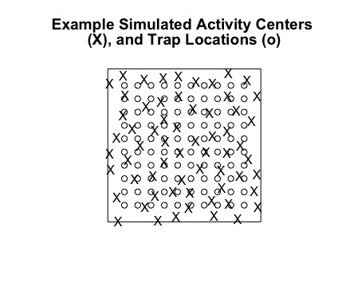

```{r setup, include=FALSE}
source('~/Google Drive/spatialMR/Rscripts/Simulation/Spatial.R')
library(knitr)
##Figure out what the last one was, start off there (so I don't have to do it manually)
starts<-data.frame()
for(j in c("t1", "t2", "t3", "t4")){
  for (k in c("g0 tilde b", "g0 tilde b + t", "g0 tilde t")){
    for (l in c("SimpleRandom", "Spread.one")){
      path<-paste("~/Google Drive/spatialMR/data/SimulationData/", j, "/", k, "/", l, sep="", collapse="")
      files<-list.files(path)
      whichDesktop<-which(files=="desktop.ini")
      whichIcon<-which(files=="Icon\r")
      files<-files[-c(whichDesktop, whichIcon)]
      if (length(files)==0){
        newLine<-data.frame(trial=j,model=k,subtype=l, startno=10001)
      }
      else{
        last<-strsplit(max(files), "")[[1]][1:5]
        last<-as.numeric(paste(last, sep="", collapse=""))
        newLine<-data.frame(trial=j,model=k,subtype=l, startno=last+1)
      }
      starts<-rbind(starts, newLine)
    }
  }
}
colnames(starts)<-c("trial", "model", "subtype", "startno")

##Sep 20 progress report
compModels<-starts[1:6,]
compModels$completed<-compModels$startno-10000
```
##Purpose
The purpose of this report is to summarize my activities from December 2015 to September 2016. From December 2015 to May 2016, I completed a thesis project entitled "Subsampling for Cost Efficiency with Spatially Explicit Capture-Recapture Models" for the University of Minnesota Honors Program. This report speculated on several causes of bias that may be introduced to SECR models through subsampling, and outlined how a simulation framework may be able to more rigourously explore these causes. From August 2016 to September 2016 (and onward to October 2016), I developed a data simulation framework capable of introducing behavioral effects, individual heterogeneity in capture probability, sample redundancy, and any combination desired. Using packages 'secr' [@secr] and doParallel [@doParallel], I further developed the necessary framework to fit the appropriate secr models onto subsamples of simulated data using parallel processing to reduce fitting time. 

##Investigation of Subsampling Bias using Empirical Data

Using data obtained from Dave Garshelis and Karen Noyce's 2012 genetic mark-recapture study of Minnesota black bears [@Cap_hair], John and I investigated the effects of subsampling randomly and non-randomly on empirical data. The four subsampling types investigated are as follows:

- SimpleRandom - n samples are chosen at random from the entire data set, without respect to period or site. This type of sampling is, on average, most representative of the original data set; for example, site-sessions that have a large number of samples would have a the largest number of samples in the subsample, and site-sessions with only one sample are unlikely to be chosen. 

- Stratified - n/6 samples are chosen at random from each of 6 sessions, without respect to site. It is important to note that this differs from a stratified random sample with proportional allocation, i.e., where the number of samples chosen from each session would be weighted by the number of samples in each session relative to the number of samples overall. 

- Spread.one - one sample is chosen from each unique site-session. After this, samples are chosen randomly until n samples are selected.  At n < 377, this strategy is idenitical to Spread.two. 

- Spread.two - two samples are chosen from each unique site-session. After this, samples are chosen randomly until n samples are selected. This method is least representative of the original data, and effectively maximizes the number of site-sessions (and thus, unique individuals) included in analysis; for example, each unique site-session with only one or two samples have both of those samples chosen, and site-sessions with large amounts of samples are under-represented relative to the original dataset. At n < 377, this strategy is idenitical to Spread.one. 


Figure 1 illustrates that sampling non-randomly (Spread.one) produced estimates that were closer to their non-subsampled counterparts than sampling randomly (SimpleRandom). John and I hypothesized that these potential biases were due to the fact that several site-sessions likely contained redundant data (>1 cluster left by a single bear at a site-session), and by exhibiting preference to novel site-sessions when sampling, we may have reduced the amount of redundant data actually being analyzed by the secr model. However, without knowing the true density of bears in the sample area, or the tendency for those bears to leave several clusters at a single site-session, we were unable to make general conclusions regarding subsampling data for use with secr models. 

In a simulated case with no redundant samples (eg, each bear that enters a trap leaves exactly one sample and leaves), one might expect random sampling to perform better (less biased, more precise) than a non-random sample, as the former would be more representative of the actual biological processes affecting movement patterns, and thus better model the heterogeneity in capture probability that arises from those patterns. As redundant samples are introduced (eg, each bear that enters a trap leaves more than one sample and leaves), one might expect that preference to unique site-sessions would once again perform best, as it did in our simulations using empirical data. 

##Investigation of Subsampling Bias using Simulated Data

###Data Simulation

A trapping grid is established (for the purposes of this report, 100 traps systematically spaced 800 meters apart), and a known number of bears (60) have their activity centers placed randomly on this grid using Simple Sequential Inhibition. 



For each period (12), each bear's likelihood of being captured is calculated for each trap in the trapping grid. This calculation is based on a half-normal distribution, based on two parameters $g0$ and $\sigma$. $g0$ represents the probability of detecting an animal whose activity center is located exactly at the trap location. $\sigma$ represents the rate at which this probability decreases as an animal’s homerange center moves further away from the trap. *For the purposes of these simulations, $\sigma$ is independent of any behavioral effects, but $g0$ is not*:

$$ log(g0) = log((g0_i + behav*captured) * IH) $$

where $g0_i$ represents a bear's base capture probability (.16 in this case), $behav$ represents the magnitude of the change in capture probability after capture, $captured$ represents a boolean value denoting whether a bear has been captured or not, and $IH$ represents a random normal value that is specific to each bear. In the case where there is no behavioral effect or individual capture heterogeneity, $behav$ becomes 0, $IH$ becomes 1, and the expression evaluates to $g0 = g0_i$. 

Sample redundancy is established by way of a Poisson distribution, where random Poisson value of samples are introduced to the dataset whenever a bear successfully leaves a sample at any given site. When sample redundancy is desired in a dataset, this poisson distribution has a $\lambda$ value greater than 0, and redundant samples are introduced. When it is not, $\lambda$ equals 0, and no samples are introduced. 

###Four trial scenarios

t1) Detections based on a half-normal distribution with a constant g0 that has no behavioral effects or individual heterogeneity. In effect, only the distance between a given bear's activity center and a given trap influences the probability of capture at that trap. 
 
t2) Detections based on a half-normal distribution with a variable g0 that changes based on each individual bear, but not on behavioral effects. In effect, the distance between a given bear's activity center and a given trap influences the probability of capture at that trap, as well as a constant additive influence of that individual bear's individual behavior.  

t3) Detections based on a half-normal distribution with a variable g0 that changes based on whether that bear has been captured, but not on individual behavioral effects. In effect, the distance between a given bear's activity center and a given trap influences the probability of capture at that trap, as well as an additive influence that occurs if the bear has been captured before.  

t4) Detections based on a half-normal distribution with a constant g0 that has no behavioral effects or individual heterogeneity. In effect, only the distance between a given bear's activity center and a given trap influences the probability of capture at that trap. After a bear has been 'captured' at a trap, redundant samples are introduced.  

```{r, include=FALSE}
source('~/Google Drive/spatialMR/Rscripts/Simulation/Spatial.R')
```

```{r}
#samples determined solely by half-normal
t1<-sim.bear(known = known, sig = sig, int.g0 = .16, trapsxy = traplocs, behav=0, IH=0, sessions=12, redun=0)
bargraph(~ID,data=t1, horizontal = TRUE, xlim=c(0,30))
tally(~Period, data=t1)

#detections determined by halfnormal with variable g0 (which is CONSTANT for the simulation for each individual)
#IH = .1 creates a random normal value on a normal dist with an sd of .1. That constant becomes an additive contstant for the log function g0.
t2<-sim.bear(known = known, sig = sig, int.g0 = .16, trapsxy = traplocs, behav=0, IH=.4, sessions=12, redun=0)
bargraph(~ID,data=t2,horizontal = TRUE, xlim=c(0,30))
tally(~Period, data=t2)

#same as i or ii, but including a behavioral effect with captures being more (or less) likely following initial capture
#If the bear has been captured previously (ie left a single sample already), the behavioral constant becomes a multiplier for the half-normal distribution of capture probabilties.
t3<-sim.bear(known = known, sig = sig, int.g0 = .16, trapsxy = traplocs, behav= -.04, IH=0, sessions=12, redun=0)
bargraph(~ID,data=t3,horizontal = TRUE, xlim=c(0,30))
tally(~Period, data=t3)

#same as above (i - iii), but with redundant data introduced by way of poisson distribution.
#After a bear is detected at a trap, redundant samples are added by way of a random value taken from a poisson distribution with lambda equal to 'redun'
t4<-sim.bear(known = known, sig = sig, int.g0 = .16, trapsxy = traplocs, behav=0, IH=0, sessions=12, redun=1.5)
bargraph(~ID,data=t4,horizontal = TRUE, xlim=c(0,30))
tally(~Period, data=t4)
```

###Subsampling and Parallel Model Fitting

Subsampling occurs in the same fashion as it had in the original project regarding empirical data, but only two forms of subsampling are being explored - SimpleRandom and Spread.one. All subsamples (thus far) have been at n=200, as the original project seemed to indicate that subsamples of larger sie produced less variable and closer density estimates to that of the entire dataset. 

Models are fit using the secr.fit function from package secr, where each scenario produces a different dataset and subsequent model fitting on a different computer processor. Models where $g0$ depends solely on behavior take an average of *BLANK* minutes to complete, on behavior and time take *BLANK* minutes, and on time solely take *BLANK* minutes.

```{r}
kable(compModels[,c(1:3,5)])
```

_Completed trials as of Sep 20 14:00._


##References
