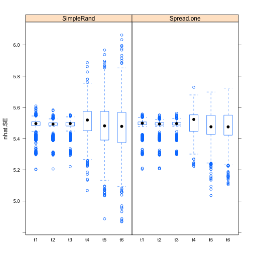

```r
setwd("/Users/nick/Google Drive/spatialMR/Rscripts/Simulation")
compile.secr.results <- function (){
library(secr)
compiled<-data.frame()
for(j in c("t1","t2","t3","t4","t5","t6")){
  for (k in c("g0 tilde b")){
      path<-paste("~/Google Drive/spatialMR/data/SimulationData/", j, "/", k, sep="", collapse="")
      files<-list.files(path)
      whichDesktop<-which(files=="desktop.ini")
      whichIcon<-which(files=="Icon\r")
      if (length(whichDesktop)>0){files<-files[-whichDesktop]}
      if (length(whichIcon)>0){files<-files[-whichIcon]}
      files<-paste(path, files, sep="/")
      
      for (m in 1:length(files)){
        newSECR<-readRDS(files[m])
        
        for (i in 1:nrow(newSECR$fullsamps)){
          newSECR$fullsamps$uniqueID[i]<-paste(newSECR$fullsamps$Period[i], newSECR$fullsamps$site[i], sep="", collapse="")
          newSECR$fullsamps$INDuniqID[i]<-paste(newSECR$fullsamps$Period[i], newSECR$fullsamps$site[i], newSECR$fullsamps$ID[i],sep="", collapse="") 
        }
        #Redundancy info
        FullN.notRedun=length(!duplicated(newSECR$fullsamps$INDuniqID))
        SubN.notRedun=length(!duplicated(newSECR$subsamps$INDuniqID))
        SubProp.notRedun=SubN.notRedun/200
        
        #Nhat info
        nhat = region.N(newSECR)[1,1]
        nhat.SE = region.N(newSECR)[1,2]
        
        #Basic info on which trial and subtype that I should have passed thru the functions themselves to model
        fileSplit<-strsplit(files[m], split = "/")[[1]]
        
        sim<-fileSplit[8]
        model<-fileSplit[7]
        trial<-fileSplit[6]
        
        g0<-newSECR$beta.vcv[1,1]
        g0.bTRUE<-newSECR$beta.vcv[2,1]
        sigma<-newSECR$beta.vcv[3,1]
        #Compiling
        newLine<-data.frame(FullN.notRedun, SubProp.notRedun, SubN.notRedun, nhat, nhat.SE, g0, g0.bTRUE, sigma, sim, model, trial)
        compiled<-rbind(compiled, newLine)
        print(newLine)
      }
    }
  }
return(compiled)

}
#compiled<-compile.secr.results
#or read in old one
compiled<-readRDS("secr.sim.resultsOct3.rds")
library(mosaic)


bwplot(nhat~trial, data=compiled)
```


```r
bwplot(SubProp.notRedun~trial, data=compiled)
```


```r
#need to split up sim into simnumber and subtype 
split<-strsplit(as.character(compiled$sim), split = "")
simNo<-NULL
subtype<-NULL
for (j in 1:nrow(compiled)){
  new<-split[[j]]
  subNew <- paste(new[1:10], sep="", collapse="")
  simNoNew <- as.numeric(paste(new[(length(new)-8):(length(new)-4)], sep="", collapse=""))
  subtype<-c(subtype, subNew)
  simNo<- c(simNo, simNoNew)
}
```

```
## Warning: NAs introduced by coercion

## Warning: NAs introduced by coercion
```

```r
compiled$subtype<-subtype
compiled$simNo<-simNo

#Two weird simulations that saved as SimpleRandom10001 (1).rds ... removing those two rows
compiled<-compiled[-c(7313, 8532),]

#Tally our simulations
tally(trial~model, data=compiled)
```

```
##      model
## trial g0 tilde b
##    t1       2442
##    t2       2434
##    t3       2436
##    t4       2436
##    t5       2434
##    t6       2428
```

```r
bwplot(nhat~trial|subtype, data=compiled)
```


```r
bwplot(SubProp.notRedun~trial|subtype, data=compiled)
```


```r
bwplot(nhat.SE~trial|subtype, data=compiled)
```



```r
#Now we need the discrepancy for each individual simulation
discrep<-NULL
for (h in c("t1", "t2", "t3", "t4", "t5", "t6")){
  j<-10001
  for (u in 1:(nrow(compiled)/12)){ ##to account for number of sims (2 subtypes * 6 trials)
    nextSim<-filter(compiled, trial==h, simNo==j)
    newLine<-nextSim[2,2:5]-nextSim[1,2:5]
    colnames(newLine)<-paste("d",colnames(newLine), sep="")
    newLine$SimpRand.nhatBias<-nextSim[1,4]-30
    newLine$Spread.nhatBias<-nextSim[2,4]-30
    newLine<-cbind(newLine, nextSim[1,c(10,11,13)])
    discrep<-rbind(discrep, newLine)
    j<-j+1
  }
}

bwplot(Spread.nhatBias~trial,data=discrep,ylim=c(-6,3))
```


```r
bwplot(SimpRand.nhatBias~trial,data=discrep, ylim=c(-6,3))
```


```r
bwplot(dSubN.notRedun~trial, data=discrep, ylim=c(-70,70))
```


